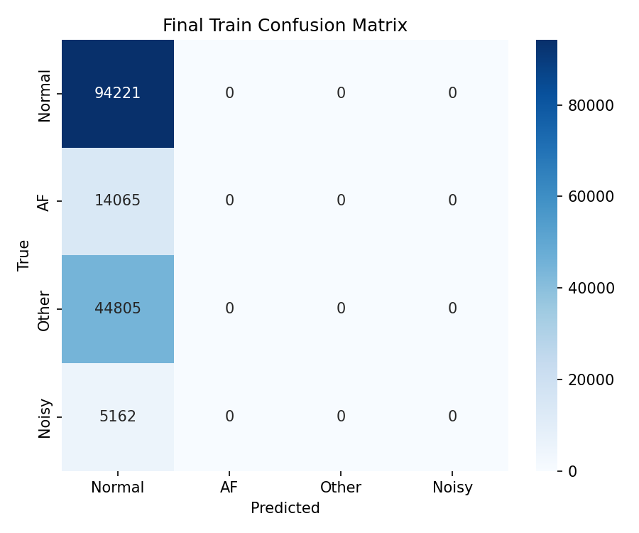
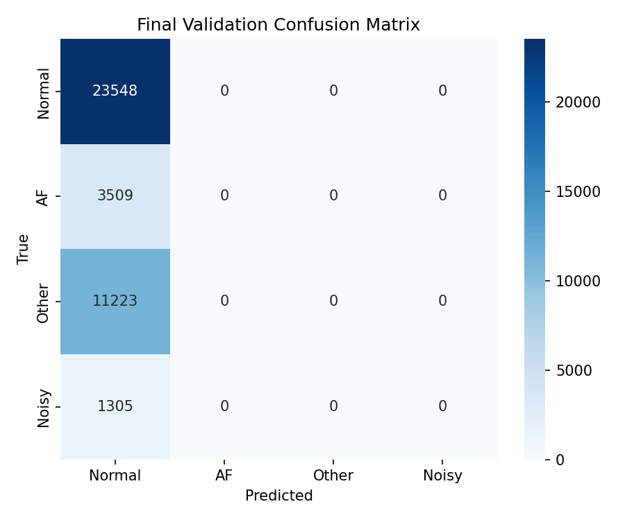
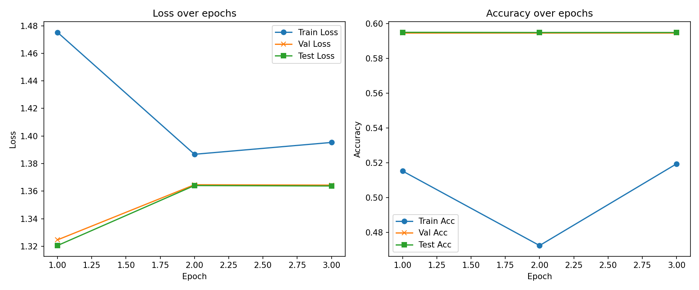

<div align="center">


# Callytics

`Callytics` is an advanced call analytics solution that leverages speech recognition and large language models (LLMs)
technologies to analyze phone conversations from customer service and call centers. By processing both the
audio and text of each call, it provides insights such as sentiment analysis, topic detection, conflict detection,
profanity word detection and summary. These cutting-edge techniques help businesses optimize customer interactions,
identify areas for improvement, and enhance overall service quality.

When an audio file is placed in the `.data/input` directory, the entire pipeline automatically starts running, and the
resulting data is inserted into the database.

**Note**: _This is only a `v1.0.0 Initial` version; many new features will be added, models
will be fine-tuned or trained from scratch, and various optimization efforts will be applied. For more information,
you can check out the [Upcoming](#upcoming) section._

**Note**: _If you would like to contribute to this repository,
please read the [CONTRIBUTING](.docs/documentation/CONTRIBUTING.md) first._


[](https://linkedin.com/in/bunyaminergen)


</div>

---

### Table of Contents

- [Introduction](#introduction)
- [Architecture](#architecture)
- [Math And Algorithm](#math-and-algorithm)
- [Features](#features)
- [Reports](#reports)
- [Demo](#demo)
- [Prerequisites](#prerequisites)
- [Installation](#installation)
- [Usage](#usage)
- [File Structure](#file-structure)
- [Database Structure](#database-structure)
- [Version Control System](#version-control-system)
- [Upcoming](#upcoming)
- [Documentations](#documentations)
- [License](#licence)
- [Links](#links)
- [Team](#team)
- [Contact](#contact)
- [Citation](#citation)

---

### Introduction

### Combine WavLM Large and RawNet2.5

**WavLM Large (Transformer-based)**

- Developed by Microsoft, WavLM relies on self-attention layers that capture fine-grained (`frame-level`) or “micro”
  acoustic features.
- It produces a **1024-dimensional** embedding, focusing on localized, short-term variations in the speech signal.

**RawNet (SincConv + Residual Blocks)**

- Uses SincConv and residual blocks to summarize the raw signal on a broader (macro) scale.
- The **Attentive Stats Pooling** layer aggregates mean + std across the entire time axis (with learnable
  attention), capturing global speaker characteristics.
- Outputs a **256-dimensional** embedding, representing the overall, longer-term structure of the speech.

These two approaches complement each other: WavLM excels at fine-detailed temporal features, while RawNet captures a
more global, statistical overview.

## Architectural Flow

1. **Raw Audio Input**
    - **No manual preprocessing** (like MFCC or mel-spectrogram).
    - A minimal **Transform** and **Segment** step (mono conversion, resample, slice/pad) formats the data into shape
      `(B, T)`.

2. **RawNet (Macro Features)**
    - **SincConv**: Learns band-pass filters in a frequency-focused manner, constrained by low/high cutoff frequencies.
    - **ResidualStack**: A set of residual blocks (optionally with SEBlock) refines the representation.
    - **Attentive Stats Pooling**: Aggregates time-domain information into mean and std with a learnable attention
      mechanism.
    - A final **FC** layer yields a 256-dimensional embedding.

3. **WavLM (Micro Features)**
    - Transformer layers operate at `frame-level`, capturing fine-grained details.
    - Produces a **1024-dimensional** embedding after mean pooling across time.

4. **Fusion**
    - Concatenate the **256-dim** RawNet embedding with the **1024-dim** WavLM embedding, resulting in **1280**
      dimensions.
    - A **Linear(1280 → 256) + ReLU** layer reduces it to a **256-dim Fusion Embedding**, combining micro and macro
      insights.

5. **AMSoftmax Loss**
    - During training, the 256-dim fusion embedding is passed to an AMSoftmax classifier (with margin + scale).
    - Embeddings of the same speaker are pulled closer, while different speakers are pushed apart in the angular space.

---

## 3. A Single End-to-End Learning Pipeline

- **Fully Automatic**: Raw waveforms go in, final speaker embeddings come out.
- **No Manual Feature Extraction**: We do not rely on handcrafted features like MFCC or mel-spectrogram.
- **Data-Driven**: The model itself figures out which frequency bands or time segments matter most.
- **Enhanced Representation**: WavLM delivers local detail, RawNet captures global stats, leading to a more robust
  speaker representation.

---

## 4. Why Avoid Preprocessing?

- **Deep Learning Principle**: The model should learn how to process raw signals rather than relying on human-defined
  feature pipelines.
- **Better Generalization**: Fewer hand-tuned hyperparameters; the model adapts better to various speakers, languages,
  and environments.
- **Scientific Rigor**: Manual feature engineering can introduce subjective design choices. Letting the network learn
  directly from data is more consistent with data-driven approaches.

---

## 5. Summary & Advantages

1. **Micro + Macro Features Combined**
    - Captures both short-term acoustic nuances (WavLM) and holistic temporal stats (RawNet).

2. **Truly End-to-End**
    - Beyond minimal slicing/padding, all layers are trainable.
    - No handcrafted feature extraction is involved.

3. **Performance**
    - Potentially outperforms using WavLM or RawNet alone in standard metrics like EER or minDCF.

In essence, **WavLM + RawNet** merges two scales of speaker representation to produce a **rich, unified embedding**. By
staying fully end-to-end, the architecture remains flexible and can leverage large amounts of data for even better
results in speaker verification tasks.

---

### Architecture


---

### Math and Algorithm

This section describes the mathematical models and algorithms used in the project.

_**Note**: The mathematical concepts and algorithms specific to this repository, rather than the models used, will be
provided in this section. Please refer to the `RESOURCES` under the [Documentations](#documentations) section for the
repositories and models utilized or referenced._

##### Silence Duration Calculation

The silence durations are derived from the time intervals between speech segments:

$$S = \{s_1, s_2, \ldots, s_n\}$$

represent _the set of silence durations (in seconds)_ between consecutive speech segments.

- **A user-defined factor**:

$$\text{factor} \in \mathbb{R}^{+}$$

To determine a threshold that distinguishes _significant_ silence from trivial gaps, two statistical methods can be
applied:

**1. Standard Deviation-Based Threshold**

- _Mean_:

$$\mu = \frac{1}{n}\sum_{i=1}^{n}s_i$$

- _Standard Deviation_:

$$
\sigma = \sqrt{\frac{1}{n}\sum_{i=1}^{n}(s_i - \mu)^2}
$$

- _Threshold_:

$$
T_{\text{std}} = \sigma \cdot \text{factor}
$$

**2. Median + Interquartile Range (IQR) Threshold**

- _Median_:

_Let:_

$$ S = \{s_{(1)} \leq s_{(2)} \leq \cdots \leq s_{(n)}\} $$

be an ordered set.

_Then:_

$$
M = \text{median}(S) =
\begin{cases}
s_{\frac{n+1}{2}}, & \text{if } n \text{ is odd}, \\\\[6pt]
\frac{s_{\frac{n}{2}} + s_{\frac{n}{2}+1}}{2}, & \text{if } n \text{ is even}.
\end{cases}
$$

- _Quartiles:_

$$
Q_1 = s_{(\lfloor 0.25n \rfloor)}, \quad Q_3 = s_{(\lfloor 0.75n \rfloor)}
$$

- _IQR_:

$$
\text{IQR} = Q_3 - Q_1
$$

- **Threshold:**

$$
T_{\text{median\\_iqr}} = M + (\text{IQR} \times \text{factor})
$$

**Total Silence Above Threshold**

Once the threshold

$$T$$

either

$$T_{\text{std}}$$

or

$$T_{\text{median\\_iqr}}$$

is defined, we sum only those silence durations that meet or exceed this threshold:

$$
\text{TotalSilence} = \sum_{i=1}^{n} s_i \cdot \mathbf{1}(s_i \geq T)
$$

where $$\mathbf{1}(s_i \geq T)$$ is an indicator function defined as:

$$
\mathbf{1}(s_i \geq T) =
\begin{cases}
1 & \text{if } s_i \geq T \\
0 & \text{otherwise}
\end{cases}
$$

**Summary:**

- **Identify the silence durations:**

$$
S = \{s_1, s_2, \ldots, s_n\}
$$

- **Determine the threshold using either:**

_Standard deviation-based:_

$$
T = \sigma \cdot \text{factor}
$$

_Median+IQR-based:_

$$
T = M + (\text{IQR} \cdot \text{factor})
$$

- **Compute the total silence above this threshold:**

$$
\text{TotalSilence} = \sum_{i=1}^{n} s_i \cdot \mathbf{1}(s_i \geq T)
$$

---

### Features

- [x] Sentiment Analysis
- [x] Profanity Word Detection
- [x] Summary
- [x] Conflict Detection
- [x] Topic Detection
- [x] **WavLM-Based Embeddings**: *Leverages WavLM to generate high-quality speech representations, improving speaker
  identification.*
- [x] **Multi-Scale Diarization (MSDD)**: *Applies multi-scale inference for precise speaker segmentation, even with
  overlapping speech.*
- [x] **Scalable Pipeline**: *Modular design allows easy integration and customization for various diarization tasks or
  research experiments.*

##### Models

- [x] OneDCNN
- [x] AdvancedOneDCNN
- [x] OneDSelfONN
- [x] AdvancedOneDSelfONN

---

### Reports

##### Metrics

##### AdvancedOneDSelfONN






##### Benchmark

Below is an example benchmark comparing **Diarization Error Rate (DER)** across different models on a given dataset:

| Model                | DER (%) |
|----------------------|--------:|
| **MSDD (Titanet)**   |     8.9 |
| **MSDD (WavLMMSDD)** |     7.4 |
| **Pyannote**         |    10.2 |

> **Note**
> - The above DER values are illustrative.
> - “MSDD (Titanet)” and “MSDD (WavLMMSDD)” indicate two different embedding sources (Titanet vs. WavLM).
> - DER measurements may vary depending on the dataset, audio conditions, and evaluation methodology.
> - For a detailed notebook showing how this benchmark was performed, please see
    > [`notebook/benchmark.ipynb`](notebook/benchmark.ipynb).

---

### Demo

[Video](videoURL)
[](videoURL)


---

### Prerequisites

##### Llama

- `GPU (min 24GB)` _(or above)_
- `Hugging Face Credentials (Account, Token)`
- `Llama-3.2-11B-Vision-Instruct` _(or above)_

##### OpenAI

- `GPU (min 12GB)` _(for other process such as `faster whisper` & `NeMo`)_
- At least one of the following is required:
    - `OpenAI Credentials (Account, API Key)`
    - `Azure OpenAI Credentials (Account, API Key, API Base URL)`

---

### Installation

##### Linux/Ubuntu

```bash
sudo apt update -y && sudo apt upgrade -y
```

```bash
sudo apt install -y ffmpeg build-essential g++
```

```bash
git clone https://github.com/bunyaminergen/Callytics
```

```bash
cd Callytics
```

```bash
conda env create -f environment.yaml
```

```bash
conda activate Callytics
```

##### Environment

`.env` file sample:

```Text
# CREDENTIALS
# OPENAI
OPENAI_API_KEY=

# HUGGINGFACE
HUGGINGFACE_TOKEN=

# AZURE OPENAI
AZURE_OPENAI_API_KEY=
AZURE_OPENAI_API_BASE=
AZURE_OPENAI_API_VERSION=

# DATABASE
DB_NAME=
DB_USER=
DB_PASSWORD=
DB_HOST=
DB_PORT=
DB_URL=
```

##### Dataset Download

```bash
aws s3 sync --no-sign-request s3://physionet-open/challenge-2017/1.0.0/training .data/raw/train
```

```bash
aws s3 sync --no-sign-request s3://physionet-open/challenge-2017/1.0.0/validation .data/raw/validation
```

---

##### Database

_In this section, an `example database` and `tables` are provided. It is a `well-structured` and `simple design`. If you
create the tables
and columns in the same structure in your remote database, you will not encounter errors in the code. However, if you
want to change the database structure, you will also need to refactor the code._

*Note*: __Refer to the [Database Structure](#database-structure) section for the database schema and tables.__

```bash
sqlite3 .db/Callytics.sqlite < src/db/sql/Schema.sql
```

##### Grafana

_In this section, it is explained how to install `Grafana` on your `local` environment. Since Grafana is a third-party
open-source monitoring application, you must handle its installation yourself and connect your database. Of course, you
can also use it with `Granafa Cloud` instead of `local` environment._

```bash
sudo apt update -y && sudo apt upgrade -y
```

```bash
sudo apt install -y apt-transport-https software-properties-common wget
```

```bash
wget -q -O - https://packages.grafana.com/gpg.key | sudo apt-key add -
```

```bash
echo "deb https://packages.grafana.com/oss/deb stable main" | sudo tee /etc/apt/sources.list.d/grafana.list
```

```bash
sudo apt install -y grafana
```

```bash
sudo systemctl start grafana-server
sudo systemctl enable grafana-server
sudo systemctl daemon-reload
```

```bash
http://localhost:3000
```

**SQLite Plugin**

```bash
sudo grafana-cli plugins install frser-sqlite-datasource
```

```bash
sudo systemctl restart grafana-server
```

```bash
sudo systemctl daemon-reload
```

---

### Usage

```python
from wavlmmsdd.audio.diarization.diarize import Diarizer
from wavlmmsdd.audio.feature.embedding import WavLMSV
from wavlmmsdd.audio.preprocess.resample import Resample
from wavlmmsdd.audio.preprocess.convert import Convert
from wavlmmsdd.audio.utils.utils import Build

def main():
    # Audio Path
    audio_path = "ae.wav"

    # Resample to 16000 Khz
    resampler = Resample(audio_file=audio_path)
    wave_16k, sr_16k = resampler.to_16k()

    # Convert to Mono
    converter = Convert(waveform=wave_16k, sample_rate=sr_16k)
    converter.to_mono()
    saved_path = converter.save()

    # Build Manifest File
    builder = Build(saved_path)
    manifest_path = builder.manifest()

    # Embedding
    embedder = WavLMSV()

    # Diarization
    diarizer = Diarizer(embedding=embedder, manifest_path=manifest_path)
    diarizer.run()

if __name__ == "__main__":
    main()
```

---

### File Structure

```Text
.
├── automation
│         └── service
│             └── callytics.service
├── config
│         ├── config.yaml
│         ├── nemo
│         │       └── diar_infer_telephonic.yaml
│         └── prompt.yaml
├── environment.yaml
├── LICENSE
├── main.py
├── README.md
├── requirements.txt
└── src
    ├── audio
    │         ├── alignment.py
    │         ├── analysis.py
    │         ├── effect.py
    │         ├── error.py
    │         ├── io.py
    │         ├── metrics.py
    │         ├── preprocessing.py
    │         ├── processing.py
    │         └── utils.py
    ├── db
    │         ├── manager.py
    │         └── sql
    │             ├── AudioPropertiesInsert.sql
    │             ├── Schema.sql
    │             ├── TopicFetch.sql
    │             ├── TopicInsert.sql
    │             └── UtteranceInsert.sql
    ├── text
    │         ├── llm.py
    │         ├── model.py
    │         ├── prompt.py
    │         └── utils.py
    └── utils
        └── utils.py
```

---

### Database Structure


---

### Version Control System

##### Releases

- [v1.0.0](https://github.com/bunyaminergen/Callytics/archive/refs/tags/v1.0.0.zip) _.zip_
- [v1.0.0](https://github.com/bunyaminergen/Callytics/archive/refs/tags/v1.0.0.tar.gz) _.tar.gz_

##### Branches

- [main](https://github.com/bunyaminergen/Callytics/main/)
- [develop](https://github.com/bunyaminergen/Callytics/develop/)

---

### Upcoming

- [ ] **Speech Emotion Recognition:** Develop a model to automatically detect emotions from speech data.
- [ ] **New Forced Alignment Model:** Train a forced alignment model from scratch.
- [ ] **New Vocal Separation Model:** Train a vocal separation model from scratch.
- [ ] **Unit Tests:** Add a comprehensive unit testing script to validate functionality.
- [ ] **Logging Logic:** Implement a more comprehensive and structured logging mechanism.
- [ ] **Warnings:** Add meaningful and detailed warning messages for better user guidance.
- [ ] **Real-Time Analysis:** Enable real-time analysis capabilities within the system.
- [ ] **Dockerization:** Containerize the repository to ensure seamless deployment and environment consistency.
- [ ] **New Transcription Models:** Integrate and test new transcription models
  suchas [AIOLA’s Multi-Head Speech Recognition Model](https://venturebeat.com/ai/aiola-drops-ultra-fast-multi-head-speech-recognition-model-beats-openai-whisper/).
- [ ] **Noise Reduction Model:** Identify, test, and integrate a deep learning-based noise reduction model. Consider
  existing models like **Facebook Research Denoiser**, **Noise2Noise**, **Audio Denoiser CNN**, and **Speech-Enhancement
  with Deep Learning**. Write test scripts for evaluation, and if necessary, train a new model for optimal performance.

##### Considerations

- [ ] Transform the code structure into a pipeline for better modularity and scalability.
- [ ] Publish the repository as a Python package on **PyPI** for wider distribution.
- [ ] Convert the repository into a Linux package to support Linux-based systems.
- [ ] Implement a two-step processing workflow: perform **diarization** (speaker segmentation) first, then apply *
  *transcription** for each identified speaker separately. This approach can improve transcription accuracy by
  leveraging speaker separation.
- [ ] Enable **parallel processing** for tasks such as diarization, transcription, and model inference to improve
  overall system performance and reduce processing time.
- [ ] Explore using **Docker Compose** for multi-container orchestration if required.
- [ ] Upload the models and relevant resources to **Hugging Face** for easier access, sharing, and community
  collaboration.
- [ ] Consider writing a **Command Line Interface (CLI)** to simplify user interaction and improve usability.
- [ ] Test the ability to use **different language models (LLMs)** for specific tasks. For instance, using **BERT** for
  profanity detection. Evaluate their performance and suitability for different use cases as a feature.

---

### Documentations

- [RESOURCES](.docs/documentation/RESOURCES.md)
- [CONTRIBUTING](.docs/documentation/CONTRIBUTING.md)

---

### Licence

- [LICENSE](LICENSE)

---

### Links

- [Github](https://github.com/bunyaminergen/Callytics)
- [Website](https://bunyaminergen.com)
- [Linkedin](https://www.linkedin.com/in/bunyaminergen)

---

### Team

- [Bunyamin Ergen](https://www.linkedin.com/in/bunyaminergen)

---

### Contact

- [Mail](mailto:info@bunyaminergen.com)

---

### Citation

```bibtex
@software{       Callytics,
  author       = {Bunyamin Ergen},
  title        = {{Callytics}},
  year         = {2024},
  month        = {12},
  url          = {https://github.com/bunyaminergen/Callytics},
  version      = {v1.0.0},
}
```

---
